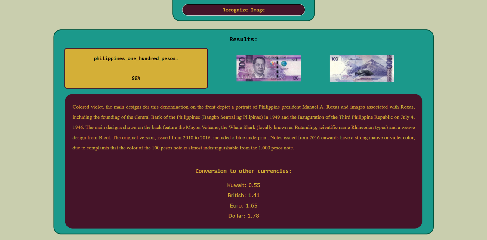

# Currency Trace

An AI-powered web that identifies coins and banknotes from a photo, and tells you their origin, history, and meaning.

## Preview

<table>
  <tr>
    <td align="center"><b>Home Page</b></td>
    <td align="center"><b>Currency Recognition</b></td>
  </tr>
  <tr>
    <td></td>
    <td></td>
  </tr>
</table>

## About

Currency Trace is a web application that helps users identify and learn about coins and banknotes from around the world. By uploading a photo, the system uses a custom-trained object detection model to recognize the currency and return details about its country of origin, denomination, historical background, and the meaning behind its design.

Beyond recognition, the app includes a built-in currency converter using live exchange rates, and a browsable catalog of coins and banknotes for users who want to explore currency information without uploading an image.

This project was built individually for a college course, combining machine learning, computer vision, and full-stack web development into a single educational, interactive platform.

## Features

- Upload a photo of a coin or banknote and get instant AI-powered identification
- Detection results include a confidence score for each identified currency
- Detailed information for each recognized currency — country of origin, denomination, historical background, and design symbolism
- Built-in currency converter with live exchange rates (powered by the Frankfurter API)
- Browsable catalog of coins and banknotes across 5 currencies — Philippine Peso, US Dollar, Euro, British Pound, and Kuwaiti Dinar — explorable without uploading an image
- Custom-trained object detection model (TensorFlow Lite) built specifically for currency recognition

## Project Setup

This project is split into two parts, each with its own setup instructions and tech stack:

- [`backend/`](backend/README.md) — Flask API with a custom-trained TensorFlow Lite object detection model
- [`frontend/`](frontend/README.md) — React client application

See each folder's README for installation steps and project structure.

## License

This project is licensed under the [MIT License](LICENSE).